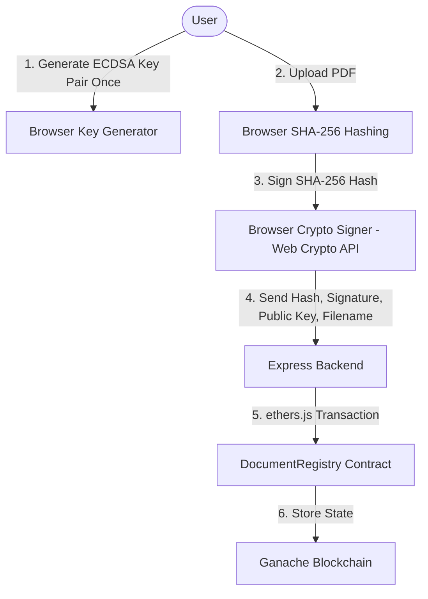

# Decentralized Document Verification System (Ethereum + Solidity + Ganache)

This project implements a secure document notarization and verification platform using client-side ECDSA P-256 signing and a Solidity smart contract on Ganache.

## System Architecture Flow



### 1. Document Registration
- **Identity Keypair**: The user generates an ECDSA P-256 identity keypair in the browser. They download the Private Key (in PKCS#8 format) for reuse across multiple document sign-offs.
- **Client-Side Hashing & Signing**: SHA-256 hashing and ECDSA signature creation are performed strictly in the browser using the Web Crypto API. The Private Key is never sent to the network or backend.
- **Relayer Submission**: The client sends the document name, calculated SHA-256 hash (in hex), signature (in hex), and public key (in raw/subjectPublicKeyInfo format) to the Express backend. The backend acts as a relayer, submitting this to the `DocumentRegistry` contract on Ganache using a pre-funded Ganache account.

### 2. Document Verification
- The verifier uploads a PDF.
- The browser calculates its SHA-256 hash.
- The browser queries the contract for the record associated with that hash.
- The system executes two security checks:
  - **Check 1: Hash Match?** If the hash is not registered on the smart contract, the document is flagged as **TAMPERED DOCUMENT** (Scenario 2).
  - **Check 2: Signature Valid?** If the hash matches but the signature cannot be validated using the stored public key, the document is flagged as **FORGED DOCUMENT** (Scenario 3).
  - If both checks pass, the document is marked as **AUTHENTIC DOCUMENT** (Scenario 1).

---

## User Review Required

> [!IMPORTANT]
> **Ganache & Ethers.js Connection**:
> The Express backend will connect to a local Ganache instance at `http://127.0.0.1:8545` (or `http://127.0.0.1:7545`). The backend uses a pre-funded Ganache account as its wallet to pay gas fees and execute transactions.

> [!NOTE]
> **Immutable Ledger**:
> In alignment with blockchain principles, data in the smart contract cannot be modified once written. We demonstrate security scenarios by trying to verify:
> 1. The original PDF (results in **AUTHENTIC**).
> 2. A modified PDF (results in **TAMPERED** - Hash mismatch).
> 3. A PDF signed with a different private key (results in **FORGED** - Signature validation fails).

---

## Proposed Changes

We will build the application using the following structure:

### Solidity Smart Contract

#### [NEW] [DocumentRegistry.sol](file:///home/linmar/Desktop/Prashant's_Project/contracts/DocumentRegistry.sol)
The Solidity smart contract written for the Ethereum network:
```solidity
// SPDX-License-Identifier: MIT
pragma solidity ^0.8.19;

contract DocumentRegistry {

    struct DocumentRecord {
        bytes32 docHash;
        string  fileName;
        bytes   signature;
        bytes   publicKey;    // ECDSA P-256 public key (~65 bytes, NOT RSA)
        uint256 timestamp;
        address registeredBy;
    }

    // Primary lookup: hash → record
    mapping(bytes32 => DocumentRecord) private records;

    // Explicit index array so getAllDocumentHashes() actually works
    bytes32[] private allHashes;

    // Existence check helper — avoids reading a zero-value record
    mapping(bytes32 => bool) private exists;

    event DocumentRegistered(
        bytes32 indexed docHash,
        string fileName,
        address indexed registeredBy,
        uint256 timestamp
    );

    function recordDocument(
        bytes32 _docHash,
        string  memory _fileName,
        bytes   memory _signature,
        bytes   memory _publicKey
    ) external {
        // Guard: revert on duplicates — immutable ledger principle
        require(!exists[_docHash], "Document already registered");

        records[_docHash] = DocumentRecord({
            docHash:      _docHash,
            fileName:     _fileName,
            signature:    _signature,
            publicKey:    _publicKey,
            timestamp:    block.timestamp,
            registeredBy: msg.sender
        });

        allHashes.push(_docHash);   // Keep index in sync
        exists[_docHash] = true;

        emit DocumentRegistered(_docHash, _fileName, msg.sender, block.timestamp);
    }

    function getDocument(bytes32 _docHash)
        external view
        returns (
            string  memory fileName,
            bytes   memory signature,
            bytes   memory publicKey,
            uint256 timestamp,
            address registeredBy
        )
    {
        require(exists[_docHash], "Document not found");
        DocumentRecord storage r = records[_docHash];
        return (r.fileName, r.signature, r.publicKey, r.timestamp, r.registeredBy);
    }

    function getAllDocumentHashes() external view returns (bytes32[] memory) {
        return allHashes;
    }
}
```

### Compile & Deploy Scripts

#### [NEW] [deploy.js](file:///home/linmar/Desktop/Prashant's_Project/scripts/deploy.js)
A script to compile `DocumentRegistry.sol` using Node's `solc` package and deploy it to Ganache using `ethers.js`.
```javascript
const { ethers } = require("ethers");
const solc = require("solc");
const fs = require("fs");
const path = require("path");

async function main() {
    const source = fs.readFileSync(
        path.resolve(__dirname, "../contracts/DocumentRegistry.sol"),
        "utf8"
    );

    // solc input format must match pragma version — use 0.8.19
    const input = {
        language: "Solidity",
        sources: { "DocumentRegistry.sol": { content: source } },
        settings: { outputSelection: { "*": { "*": ["abi", "evm.bytecode"] } } }
    };

    const output = JSON.parse(solc.compile(JSON.stringify(input)));

    // Check for compilation errors before deploying
    if (output.errors) {
        output.errors.forEach(e => console.error(e.formattedMessage));
        if (output.errors.some(e => e.severity === "error")) process.exit(1);
    }

    const contract = output.contracts["DocumentRegistry.sol"]["DocumentRegistry"];
    const abi      = contract.abi;
    const bytecode = contract.evm.bytecode.object;

    // Connect to Ganache (port 8545 or 7545)
    const provider = new ethers.JsonRpcProvider("http://127.0.0.1:8545");
    const signer   = await provider.getSigner(0); // First pre-funded Ganache account

    const factory  = new ethers.ContractFactory(abi, bytecode, signer);
    const deployed = await factory.deploy();
    await deployed.waitForDeployment();

    const address = await deployed.getAddress();
    console.log("Contract deployed at:", address);

    // Write config for server.js and frontend to consume
    fs.writeFileSync(
        path.resolve(__dirname, "../contract_config.json"),
        JSON.stringify({ address, abi }, null, 2)
    );
}

main().catch(console.error);
```

### Backend (Node.js + Express)

#### [NEW] [package.json](file:///home/linmar/Desktop/Prashant's_Project/package.json)
Initializes dependencies:
```json
{
  "name": "decentralized-document-verification",
  "version": "1.0.0",
  "description": "ECDSA Document verification on Ethereum/Ganache",
  "main": "server.js",
  "scripts": {
    "deploy": "node scripts/deploy.js",
    "start": "node server.js"
  },
  "dependencies": {
    "express": "^4.18.2",
    "cors": "^2.8.5",
    "helmet": "^7.1.0",
    "express-rate-limit": "^7.1.5",
    "ethers": "^6.9.0",
    "solc": "0.8.19"
  }
}
```

#### [NEW] [server.js](file:///home/linmar/Desktop/Prashant's_Project/server.js)
Express server handling network relaying and data validation:
- Exposes API routes:
  - `GET /api/blockchain/status`: Returns contract address and Ganache node metadata.
  - `GET /api/blockchain/records`: Queries contract for all registered documents.
  - `POST /api/blockchain/record`: Validates format inputs, calls the smart contract's `recordDocument` function using a server-side wallet key, and returns transaction details.
- Validates data inputs strictly:
  - Verifies that `docHash` is exactly 32 bytes (64 hex characters).
  - Verifies `publicKey` size: Reject RSA keys. ECDSA P-256 uncompressed public key is exactly 65 bytes (`MAX_PUBLIC_KEY_BYTES = 65`).
  - Verifies `signature` size: DER-encoded ECDSA signature upper bound is 72 bytes (`MAX_SIGNATURE_BYTES = 72`).
- Serves custom CSP and anti-clickjacking headers via Helmet.

### Frontend Files

#### [NEW] [public/index.html](file:///home/linmar/Desktop/Prashant's_Project/public/index.html)
A single-page dark-mode application featuring:
- **Header**: Connection status, Ganache block height, and node address.
- **Identity Tab**: Generate and download ECDSA P-256 key pairs once.
- **Sign Tab**: Drop a PDF, display calculated SHA-256 hash in hex, paste/load your Private Key, sign the hash, and register on the blockchain.
- **Ledger Tab**: Visual timeline of blocks fetched from the smart contract showing hashes, signatures, and timestamps.
- **Verify Tab**: Drop a PDF to run the dual-security check (Hash match check and signature check) and show clear statuses (AUTHENTIC, TAMPERED, or FORGED).

#### [NEW] [public/styles.css](file:///home/linmar/Desktop/Prashant's_Project/public/styles.css)
Premium dark-theme styles:
- Deep grays and charcoal backgrounds with glassmorphism panels.
- Neon green indicators for **AUTHENTIC**, amber for **FORGED**, and crimson red for **TAMPERED**.
- Clean transition effects for file drag-and-drop zones.

#### [NEW] [public/app.js](file:///home/linmar/Desktop/Prashant's_Project/public/app.js)
Frontend Javascript:
- Uses Web Crypto API (`window.crypto.subtle`) for SHA-256 hashing, ECDSA P-256 key generation, and signing.
- Standardizes key exports/imports to PEM formatting.
- Drives UI navigation, forms, and validation outputs.

---

## Verification Plan

### Automated / Contract Tests
- Verify contract deployment succeeds.
- Validate that duplicate registrations are blocked (should revert in EVM).

### Manual Verification Scenarios
1. **Scenario 1 (Authentic)**: Generate keys, register a PDF, and verify it. Result: **AUTHENTIC DOCUMENT** (Both checks pass).
2. **Scenario 2 (Tampered)**: Modify the PDF content or upload a different file for verification. Result: **TAMPERED DOCUMENT** (Hash Match Check fails).
3. **Scenario 3 (Forged)**: Verify the original PDF, but manually supply a signature generated with a different private key. Result: **FORGED DOCUMENT** (Hash matches, but Signature Verification fails).
